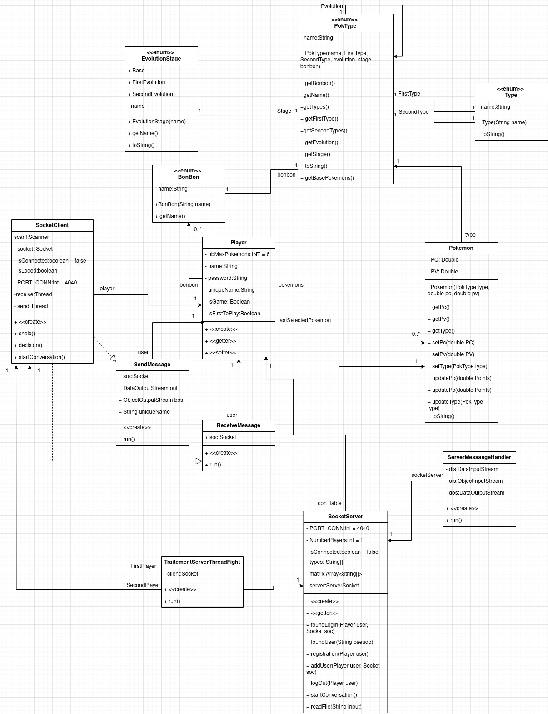
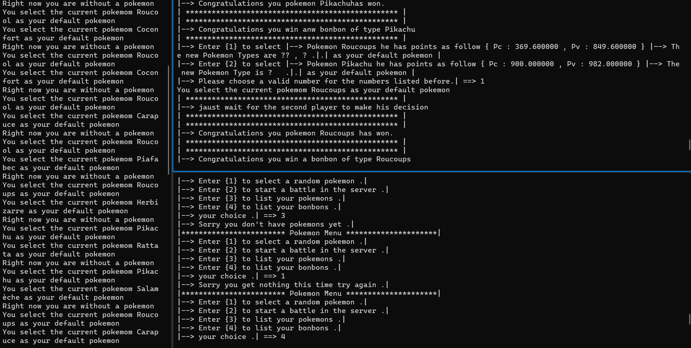
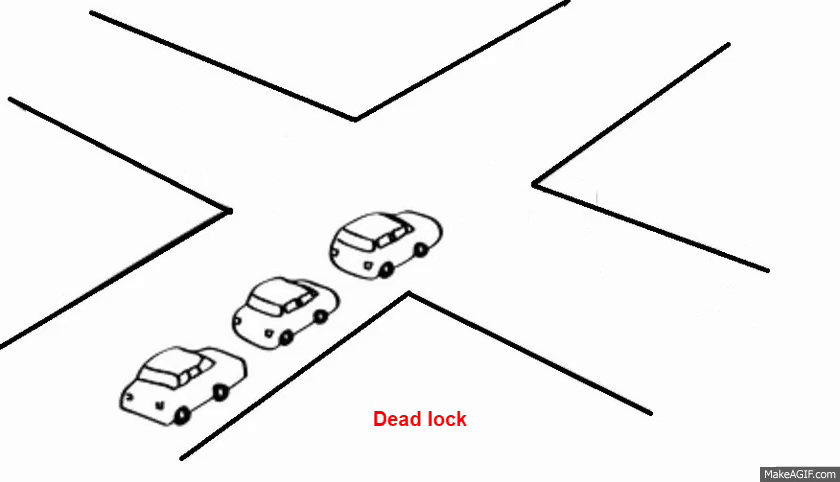

# Diagram de Class



# Pour commencer

## Pré-requis
Pour pouvoir utiliser PokemonCli, il est nécessaire d'avoir Java installé sur votre système. Ce programme a été testé avec succès sous Java 21.

Si votre version actuelle de Java est inférieure à Java 21, je vous recommande de mettre à jour votre installation Java vers la version requise. Vous pouvez télécharger la dernière version de Java depuis le site officiel de Java (https://www.oracle.com/java/technologies/javase-downloads.html) ou utiliser un gestionnaire de paquets adapté à votre système d'exploitation.

Une fois Java 21 installé, vous devriez être en mesure d'exécuter PokemonCli sans rencontrer de problèmes. Si vous avez d'autres questions ou des difficultés, n'hésitez pas à me les faire savoir.

## Installation
Il semble que le dépôt GitHub que vous avez cloné contient deux fichiers JAR, un pour le serveur et un autre pour le joueur. Pour installer et exécuter PokemonCli, vous devrez peut-être suivre des étapes spécifiques pour chaque composant. Voici comment vous pourriez procéder :
### Pour le Serveur
1. Clonez le dépôt GitHub :
```bash
git clone https://github.com/K-Ilyas/TP-Pokemon
```
2. Accédez au répertoire du serveur :
```bash
cd TP-Pokemon
```
3. Exécutez le serveur :
```bash 
javac SocketServer.java
java SocketServer
```

### Pour le joueur :
1. Accédez au répertoire du joueur :
```bash
cd TP-Pokemon
```

2. exécutez le joueur :
```bash
javac PlayerMain.java
java PlayerMain
```
Assurez-vous d'avoir Java installé sur votre machine avant d'exécuter ces commandes. Vous devrez peut-être également vous assurer que les ports requis sont ouverts, selon les instructions fournies dans le dépôt.

# Fabriqué avec
Ce code est entièrement écrit en Java, utilisant les notions de sérialisation pour l'envoi des messages du client vers le serveur et vice versa, ainsi que les notions de sockets pour assurer la connexion entre les pairs des joueurs.

En outre, il s'appuie sur la puissance des mécanismes de sérialisation de Java pour faciliter le transfert efficace de données entre le client et le serveur. La sérialisation permet de convertir des objets en un format binaire, prêt à être transmis via le réseau, et de les reconstituer du côté récepteur.

L'utilisation des sockets, quant à elle, démontre une approche robuste pour établir et maintenir des connexions entre les pairs de joueurs. Les sockets offrent un moyen fiable de communication bidirectionnelle, essentiel pour assurer la synchronisation et la transmission fluide des données dans un environnement réseau.

Cette combinaison de sérialisation et de sockets témoigne d'une architecture réseau bien pensée, favorisant des échanges de données fluides et une communication efficiente entre les clients et le serveur. Si vous avez des questions spécifiques ou si vous souhaitez plus de détails sur des parties spécifiques du code, n'hésitez pas à les partager.


# Comment Utiliser
1. Exécutez la classe SocketServer pour démarrer le serveur.

2. Les joueurs se connectent au serveur en utilisant un client compatible avec les sockets.

3. Chaque joueur choisit ses Pokémon parmi une liste prédéfinie.

4. Les combats Pokémon entre les joueurs sont gérés par la classe TraitementServerThreadFight.



# Aspects Techniques
## Communication par Sockets

Le serveur utilise le mécanisme de sockets pour établir des connexions avec les clients. Les sockets fournissent une communication bidirectionnelle entre le serveur et les clients.

## Thread Pool et Multithreading
Le serveur utilise un pool de threads avec la classe ExecutorService pour gérer plusieurs connexions simultanées. Chaque nouvelle connexion est traitée dans un thread distinct pour éviter de bloquer le serveur.

## Sérialisation d'Objets:
La sérialisation d'objets est utilisée pour échanger des informations complexes entre le serveur et les clients. Par exemple, les objets Player, Pokemon, et Bonbon peuvent être sérialisés et désérialisés pour le transfert de données.

## Fichiers de Configuration:
Le serveur utilise un fichier de configuration (table_types.txt) pour stocker des informations statiques telles que les types de Pokémon. Cela permet de séparer les données du code et facilite les mises à jour sans modification du code source.

## Verrouillage (Locking) pour la Concurrency Control
Des mécanismes de verrouillage (ReentrantLock) sont utilisés pour gérer la concurrence lors des combats Pokémon. Cela garantit que les opérations critiques ne sont pas interrompues par d'autres threads.

## Gestion des Exceptions
Le code implémente une gestion des exceptions pour traiter les erreurs potentielles telles que les fichiers non trouvés, les erreurs de sérialisation, etc. Cela améliore la robustesse du serveur.

## Persistance des Données des Joueurs
Les informations des joueurs, telles que les Pokémon et les réalisations, sont persistées dans des fichiers (PlayersAchivements/) à la fin de chaque combat. Cela garantit que les données des joueurs sont sauvegardées entre les sessions.

## Messages entre Joueurs après un Combat
Le serveur permet aux joueurs de communiquer entre eux après un combat. Des threads distincts (ServerMesageHandle) sont utilisés pour gérer la communication bidirectionnelle entre le serveur et chaque joueur.

## Génération de Nombres Aléatoires
La classe TraitementServerThreadFight utilise une méthode pour générer des nombres aléatoires dans une plage spécifiée. Cela peut être important pour introduire des éléments d'aléatoire dans le jeu, par exemple, lors de la détermination de l'issue d'un combat.

## Interfaces Emoji pour les Types de Pokémon
La classe Type utilise des emojis dans les interfaces utilisateur pour représenter visuellement les différents types de Pokémon. Cela ajoute une touche visuelle au projet.


## Gestion des Joueurs

Le serveur maintient une table de hachage associant les informations des joueurs avec leurs connexions respectives. Il prend en charge l'inscription, la recherche et la déconnexion des joueurs.

### Communication entre Joueurs

Les joueurs peuvent engager des combats via des connexions sécurisées. Le serveur coordonne ces combats en utilisant des threads dédiés pour chaque paire de joueurs.

### Types de Pokémon et Matrice de Combat
Les types de Pokémon et la matrice de combat sont chargés depuis un fichier externe (table_types.txt). Ces informations sont utilisées pour déterminer les résultats des combats entre différents types de Pokémon.


## Gestion des Fichiers Audio

Le serveur intègre une fonctionnalité de lecture audio pour améliorer l'expérience utilisateur. Un extrait de code illustrant cette fonctionnalité est présenté ci-dessous :
```java
try {
    File audioFile = new File("pokemon.wav");
    AudioInputStream audioStream = AudioSystem.getAudioInputStream(audioFile);
    Clip clip = AudioSystem.getClip();
    clip.open(audioStream);
    clip.loop(Clip.LOOP_CONTINUOUSLY);
} catch (Exception ex) {
    System.out.println("Error playing audio file: " + ex.getMessage());
}
```
Ce code charge un fichier audio ("pokemon.wav") et le joue en boucle pour fournir une ambiance sonore pendant le jeu.

# Probleme rencontre
## DeadLook



Une situation de blocage sur une ressource peut survenir si et seulement si toutes les conditions suivantes sont réunies simultanément dans un système1:

- Exclusion mutuelle: Au moins une ressource doit être conservée dans un mode non partageable. Sinon, les processus ne seraient pas empêchés d'utiliser la ressource si nécessaire. Un seul processus peut utiliser la ressource à un instant donné2.
- Hold and wait ou resource holding : un processus détient actuellement au moins une ressource et demande des ressources supplémentaires qui sont détenues par d'autres processus.
- Non preemption: une ressource ne peut être libérée que volontairement par le processus qui la détient.
- Attente circulaire: chaque processus doit attendre une ressource qui est détenue par un autre processus, qui à son tour attend que le premier processus libère la ressource. En général, il existe un ensemble de processus en attente, P = { P 1 , P 2 ,…, P N }, tel que P 1 attend une ressource détenue par P 2 , P 2 attend une ressource détenue par P 3 3

Ces quatre conditions sont connues sous le nom de «conditions de Coffman» d'après leur première description dans un article de 1971 par Edward G. Coffman, Jr.

Bien que ces conditions soient suffisantes pour produire un blocage sur les systèmes de ressources à instance unique, elles indiquent uniquement la possibilité d'un blocage sur les systèmes ayant plusieurs instances de ressources4. 

